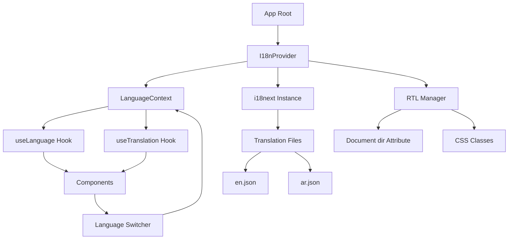

# Design Document: Arabic Language Support

## Overview

This design document outlines the implementation of a comprehensive internationalization (i18n) system for the e-commerce website, enabling full support for Arabic language alongside English. The system will provide seamless language switching, right-to-left (RTL) layout support, and complete translation coverage across all UI components, pages, and content.

### Key Design Goals

1. **Minimal Performance Impact**: Lazy-load translations and optimize font loading
2. **Developer Experience**: Simple API for accessing translations with TypeScript support
3. **Maintainability**: Structured translation files with clear organization
4. **Extensibility**: Architecture that supports adding more languages in the future
5. **User Experience**: Instant language switching with persistent preferences

### Technology Stack

- **i18n Library**: react-i18next (industry standard, 11M+ weekly downloads)
- **Translation Format**: JSON files with nested structure
- **State Management**: React Context API for language state
- **Storage**: localStorage for persistence
- **Styling**: Tailwind CSS with RTL plugin support
- **Fonts**: Google Fonts (Cairo for Arabic, existing fonts for English)

### Research Summary

After evaluating multiple i18n solutions (react-intl, FormatJS, custom implementation), react-i18next was selected for:
- Comprehensive React hooks integration
- Built-in pluralization and interpolation
- Namespace support for code splitting
- Strong TypeScript support
- Active maintenance and community

For RTL support, the approach combines:
- CSS logical properties (margin-inline, padding-inline)
- Tailwind's RTL plugin for automatic class mirroring
- Document-level dir attribute management
- Component-level RTL-aware styling

## Architecture

### System Components



### Data Flow

1. **Initialization**:
   - App loads → I18nProvider initializes
   - Check localStorage for saved language preference
   - Load appropriate translation file
   - Set document direction (LTR/RTL)
   - Apply language-specific fonts

2. **Language Switch**:
   - User clicks Language Switcher
   - LanguageContext updates current locale
   - i18next changes active language
   - RTL Manager updates document direction
   - All components re-render with new translations
   - Preference saved to localStorage

3. **Translation Retrieval**:
   - Component calls useTranslation hook
   - Hook provides t() function
   - t('key.path') retrieves translation from active language file
   - Fallback to key if translation missing

### Directory Structure

```
src/
├── i18n/
│   ├── config.ts              # i18next configuration
│   ├── locales/
│   │   ├── en/
│   │   │   ├── common.json    # Shared UI elements
│   │   │   ├── navigation.json
│   │   │   ├── products.json
│   │   │   ├── cart.json
│   │   │   ├── checkout.json
│   │   │   ├── auth.json
│   │   │   ├── admin.json
│   │   │   └── errors.json
│   │   └── ar/
│   │       ├── common.json
│   │       ├── navigation.json
│   │       ├── products.json
│   │       ├── cart.json
│   │       ├── checkout.json
│   │       ├── auth.json
│   │       ├── admin.json
│   │       └── errors.json
│   └── types.ts               # TypeScript definitions
├── contexts/
│   └── LanguageContext.tsx    # Language state management
├── hooks/
│   └── useLanguage.ts         # Custom language hook
└── components/
    └── LanguageSwitcher.tsx   # UI component for switching
```

## Components and Interfaces

### I18n Configuration

**File**: `src/i18n/config.ts`

```typescript
interface I18nConfig {
  defaultLanguage: 'en' | 'ar';
  supportedLanguages: Array<'en' | 'ar'>;
  fallbackLanguage: 'en';
  namespaces: string[];
  interpolation: {
    escapeValue: boolean;
  };
}
```

**Responsibilities**:
- Initialize i18next instance
- Configure language detection
- Set up resource loading
- Define interpolation rules
- Configure pluralization

### Language Context

**File**: `src/contexts/LanguageContext.tsx`

```typescript
interface LanguageContextValue {
  currentLanguage: 'en' | 'ar';
  changeLanguage: (lang: 'en' | 'ar') => Promise<void>;
  isRTL: boolean;
  direction: 'ltr' | 'rtl';
}
```

**Responsibilities**:
- Maintain current language state
- Provide language switching function
- Expose RTL status
- Persist language preference
- Notify components of language changes

### Translation Provider

**File**: `src/i18n/config.ts` (exported component)

```typescript
interface TranslationProviderProps {
  children: React.ReactNode;
}
```

**Responsibilities**:
- Wrap application with i18next provider
- Initialize translation system
- Load translation resources
- Handle loading states

### Language Switcher Component

**File**: `src/components/LanguageSwitcher.tsx`

```typescript
interface LanguageSwitcherProps {
  variant?: 'button' | 'dropdown';
  className?: string;
}
```

**Responsibilities**:
- Display current language
- Provide UI for language selection
- Trigger language change
- Show visual feedback during switch

### RTL Manager

**Implementation**: Integrated into LanguageContext

```typescript
interface RTLManager {
  applyDirection: (lang: 'en' | 'ar') => void;
  getDirection: (lang: 'en' | 'ar') => 'ltr' | 'rtl';
}
```

**Responsibilities**:
- Set document dir attribute
- Apply RTL-specific CSS classes
- Manage font switching
- Handle layout mirroring

### Custom Hooks

**useLanguage Hook**

```typescript
interface UseLanguageReturn {
  currentLanguage: 'en' | 'ar';
  changeLanguage: (lang: 'en' | 'ar') => Promise<void>;
  isRTL: boolean;
  t: TFunction; // Translation function
}
```

**useTranslation Hook** (from react-i18next)

```typescript
interface UseTranslationReturn {
  t: TFunction;
  i18n: i18n;
  ready: boolean;
}
```

## Data Models

### Translation File Structure

Each namespace follows this structure:

```typescript
interface TranslationNamespace {
  [key: string]: string | TranslationNamespace;
}
```

**Example**: `common.json`

```json
{
  "buttons": {
    "addToCart": "Add to Cart",
    "checkout": "Checkout",
    "login": "Login",
    "register": "Register",
    "submit": "Submit",
    "cancel": "Cancel",
    "save": "Save",
    "delete": "Delete",
    "edit": "Edit",
    "search": "Search"
  },
  "labels": {
    "email": "Email",
    "password": "Password",
    "name": "Name",
    "phone": "Phone",
    "address": "Address"
  },
  "messages": {
    "loading": "Loading...",
    "success": "Success!",
    "error": "An error occurred",
    "noResults": "No results found"
  }
}
```

**Example**: `navigation.json`

```json
{
  "header": {
    "home": "Home",
    "shop": "Shop",
    "about": "About",
    "contact": "Contact",
    "cart": "Cart",
    "wishlist": "Wishlist",
    "account": "Account"
  },
  "footer": {
    "quickLinks": "Quick Links",
    "customerService": "Customer Service",
    "followUs": "Follow Us",
    "copyright": "© 2024 E-Commerce. All rights reserved."
  }
}
```

### Language Preference Storage

**localStorage Key**: `user-language-preference`

```typescript
interface LanguagePreference {
  locale: 'en' | 'ar';
  timestamp: number;
}
```

### Product Translation Model

Products will have language-specific fields:

```typescript
interface ProductTranslations {
  en: {
    name: string;
    description: string;
    category: string;
    attributes?: Record<string, string>;
  };
  ar: {
    name: string;
    description: string;
    category: string;
    attributes?: Record<string, string>;
  };
}

interface Product {
  id: string;
  translations: ProductTranslations;
  price: number;
  images: string[];
  // ... other fields
}
```

### Locale Configuration

```typescript
type Locale = 'en' | 'ar';

interface LocaleConfig {
  code: Locale;
  name: string;
  nativeName: string;
  direction: 'ltr' | 'rtl';
  dateFormat: string;
  numberFormat: Intl.NumberFormatOptions;
  currencyFormat: Intl.NumberFormatOptions;
}

const localeConfigs: Record<Locale, LocaleConfig> = {
  en: {
    code: 'en',
    name: 'English',
    nativeName: 'English',
    direction: 'ltr',
    dateFormat: 'MM/DD/YYYY',
    numberFormat: { useGrouping: true },
    currencyFormat: { style: 'currency', currency: 'USD' }
  },
  ar: {
    code: 'ar',
    name: 'Arabic',
    nativeName: 'العربية',
    direction: 'rtl',
    dateFormat: 'DD/MM/YYYY',
    numberFormat: { useGrouping: true },
    currencyFormat: { style: 'currency', currency: 'USD' }
  }
};
```


## Correctness Properties

*A property is a characteristic or behavior that should hold true across all valid executions of a system—essentially, a formal statement about what the system should do. Properties serve as the bridge between human-readable specifications and machine-verifiable correctness guarantees.*


### Property 1: Language Toggle

*For any* initial language state (English or Arabic), when the language switcher is triggered, the system should change to the opposite language.

**Validates: Requirements 1.1**

### Property 2: Language Preference Persistence Round-Trip

*For any* language selection (English or Arabic), saving the preference to localStorage and then loading it should return the same language value.

**Validates: Requirements 1.2, 1.3**

### Property 3: Translation File Loading

*For any* supported locale (English or Arabic), the i18n system should successfully load the corresponding translation files without errors.

**Validates: Requirements 2.1**

### Property 4: Translation Function Availability

*For any* component rendered within the Translation Provider, the translation function should be accessible via React context.

**Validates: Requirements 2.2**

### Property 5: Translation Retrieval with Fallback

*For any* translation key and locale, the system should return the translated string if it exists, or return the key itself as fallback if the translation is missing.

**Validates: Requirements 2.3, 2.4, 5.1, 5.2, 5.3, 5.4, 5.6**

### Property 6: Nested Translation Key Support

*For any* nested translation structure, accessing a value using dot notation (e.g., "header.navigation.home") should return the correct nested value.

**Validates: Requirements 2.5**

### Property 7: Variable Interpolation

*For any* translation string containing variable placeholders and any set of variable values, interpolation should correctly replace placeholders with the provided values.

**Validates: Requirements 2.6**

### Property 8: Document Direction Setting

*For any* locale, setting the language should apply the correct document direction (RTL for Arabic, LTR for English).

**Validates: Requirements 3.1, 3.2**

### Property 9: Number and Date Directionality Preservation

*For any* number, date, or currency value, the directionality should remain consistent (LTR) regardless of the current locale setting.

**Validates: Requirements 3.5**

### Property 10: Locale-Specific Formatting

*For any* date, time, number, or currency value and any locale, the formatted output should follow the conventions of that locale (separators, order, symbols).

**Validates: Requirements 10.1, 10.2, 10.3, 10.4, 5.5**

### Property 11: URL Localization with Preservation

*For any* route path and locale, the generated URL should include the locale prefix and preserve the locale when the URL is accessed.

**Validates: Requirements 12.1, 12.3**

### Property 12: URL Redirect Based on Preference

*For any* URL without a locale prefix and any stored language preference, the system should redirect to the URL with the appropriate locale prefix.

**Validates: Requirements 12.2**

### Property 13: Query and Hash Preservation During Language Switch

*For any* URL containing query parameters or hash fragments, switching the language should preserve these URL components in the new localized URL.

**Validates: Requirements 12.5**

## Error Handling

### Translation Errors

**Missing Translation Keys**
- **Scenario**: A component requests a translation key that doesn't exist
- **Handling**: Return the key itself as a string (e.g., "header.missing.key")
- **User Impact**: Developers can identify missing translations during development
- **Logging**: Log warning to console in development mode with missing key path

**Translation File Load Failure**
- **Scenario**: Network error or missing translation file during initialization
- **Handling**: Fall back to English translations, show error boundary
- **User Impact**: Application remains functional with English fallback
- **Logging**: Log error with file path and error details
- **Recovery**: Retry loading on next language switch attempt

**Malformed Translation Files**
- **Scenario**: JSON parsing error in translation file
- **Handling**: Catch parsing error, use empty object as fallback, log error
- **User Impact**: Missing translations for that namespace
- **Logging**: Log error with file name and parsing error details
- **Recovery**: Application continues with other namespaces

### Language Switching Errors

**localStorage Access Denied**
- **Scenario**: Browser blocks localStorage access (private mode, security settings)
- **Handling**: Store language preference in memory only, warn user
- **User Impact**: Language preference not persisted across sessions
- **Logging**: Log warning about localStorage unavailability
- **Recovery**: Language switching still works, just not persisted

**Invalid Language Code**
- **Scenario**: URL contains unsupported language code (e.g., /fr/shop)
- **Handling**: Redirect to default language (English) with same path
- **User Impact**: User sees content in English instead of invalid language
- **Logging**: Log warning about invalid language code
- **Recovery**: Automatic redirect to valid language

**Language Switch During Navigation**
- **Scenario**: User switches language while page is loading
- **Handling**: Cancel pending requests, reload with new language
- **User Impact**: Brief loading delay, correct language displayed
- **Logging**: Log language switch event
- **Recovery**: Automatic reload with new language

### RTL Layout Errors

**CSS Not Loaded**
- **Scenario**: RTL-specific CSS fails to load
- **Handling**: Apply inline direction styles as fallback
- **User Impact**: Basic RTL layout works, some styling may be off
- **Logging**: Log CSS load failure
- **Recovery**: Retry CSS load on next page navigation

**Font Loading Failure**
- **Scenario**: Arabic font fails to load from CDN
- **Handling**: Fall back to system Arabic fonts
- **User Impact**: Text displays in system font instead of custom font
- **Logging**: Log font load failure with font name
- **Recovery**: Retry font load in background

### Data Formatting Errors

**Invalid Date/Number Format**
- **Scenario**: Intl.DateTimeFormat or Intl.NumberFormat throws error
- **Handling**: Catch error, return unformatted value as string
- **User Impact**: Value displays without locale-specific formatting
- **Logging**: Log formatting error with value and locale
- **Recovery**: Display raw value to prevent UI breakage

**Missing Locale Data**
- **Scenario**: Browser doesn't support locale-specific formatting
- **Handling**: Fall back to English locale formatting
- **User Impact**: Formatting uses English conventions
- **Logging**: Log unsupported locale warning
- **Recovery**: Use English formatting as fallback

### Product Translation Errors

**Missing Product Translation**
- **Scenario**: Product has no translation for current locale
- **Handling**: Display English version with language indicator
- **User Impact**: Product visible but in English
- **Logging**: Log missing product translation with product ID
- **Recovery**: Admin can add translation later

**Partial Product Translation**
- **Scenario**: Product has some fields translated but not all
- **Handling**: Show translated fields, fall back to English for missing fields
- **User Impact**: Mixed language display for that product
- **Logging**: Log partial translation with missing fields
- **Recovery**: Display available translations, fall back for rest

### Error Boundaries

**Component-Level Errors**
- **Scenario**: Translation-related error crashes a component
- **Handling**: Error boundary catches error, shows fallback UI
- **User Impact**: Component shows error message, rest of app works
- **Logging**: Log component error with stack trace
- **Recovery**: User can refresh or navigate away

**App-Level Errors**
- **Scenario**: Critical i18n initialization failure
- **Handling**: Top-level error boundary shows error page
- **User Impact**: Full page error message with refresh option
- **Logging**: Log critical error with full context
- **Recovery**: User can refresh page to retry initialization

## Testing Strategy

### Overview

The testing strategy employs a dual approach combining unit tests for specific scenarios and property-based tests for comprehensive validation of universal behaviors. This ensures both concrete edge cases and general correctness across all possible inputs.

### Property-Based Testing

**Library**: fast-check (for TypeScript/JavaScript)

**Configuration**:
- Minimum 100 iterations per property test
- Each test tagged with feature name and property reference
- Custom generators for domain-specific types (locales, translation keys, URLs)

**Property Test Suite**:

**Test 1: Language Toggle Property**
```typescript
// Feature: arabic-language-support, Property 1: Language toggle
// For any initial language state, toggling should switch to opposite language
```
- **Generator**: Arbitrary locale ('en' | 'ar')
- **Test**: Toggle language, verify it changed to opposite
- **Assertions**: New language !== initial language, only valid locales

**Test 2: Language Persistence Round-Trip**
```typescript
// Feature: arabic-language-support, Property 2: Language preference persistence
// For any language, save then load should return same value
```
- **Generator**: Arbitrary locale ('en' | 'ar')
- **Test**: Save to localStorage, load back, compare
- **Assertions**: Loaded language === saved language

**Test 3: Translation File Loading**
```typescript
// Feature: arabic-language-support, Property 3: Translation file loading
// For any supported locale, translation files should load successfully
```
- **Generator**: Arbitrary locale ('en' | 'ar')
- **Test**: Initialize i18n with locale, verify no errors
- **Assertions**: i18n.isInitialized === true, no errors thrown

**Test 4: Translation Function Availability**
```typescript
// Feature: arabic-language-support, Property 4: Translation function availability
// For any component in provider, translation function should be accessible
```
- **Generator**: Arbitrary React component
- **Test**: Render in provider, access useTranslation hook
- **Assertions**: t function is defined and callable

**Test 5: Translation Retrieval with Fallback**
```typescript
// Feature: arabic-language-support, Property 5: Translation retrieval with fallback
// For any key and locale, return translation or key as fallback
```
- **Generator**: Arbitrary translation key (valid and invalid), arbitrary locale
- **Test**: Request translation, verify result
- **Assertions**: Result is string, equals translation or key

**Test 6: Nested Key Support**
```typescript
// Feature: arabic-language-support, Property 6: Nested translation key support
// For any nested structure, dot notation should retrieve correct value
```
- **Generator**: Arbitrary nested object, arbitrary path
- **Test**: Access nested value via dot notation
- **Assertions**: Retrieved value matches direct object access

**Test 7: Variable Interpolation**
```typescript
// Feature: arabic-language-support, Property 7: Variable interpolation
// For any translation with variables, interpolation should replace placeholders
```
- **Generator**: Arbitrary translation string with {{var}}, arbitrary variable values
- **Test**: Interpolate variables, verify replacement
- **Assertions**: Result contains variable values, no placeholders remain

**Test 8: Document Direction Setting**
```typescript
// Feature: arabic-language-support, Property 8: Document direction setting
// For any locale, correct direction should be applied
```
- **Generator**: Arbitrary locale ('en' | 'ar')
- **Test**: Set language, check document.dir
- **Assertions**: dir === 'rtl' for Arabic, 'ltr' for English

**Test 9: Number/Date Directionality Preservation**
```typescript
// Feature: arabic-language-support, Property 9: Number and date directionality
// For any number/date and locale, directionality should remain LTR
```
- **Generator**: Arbitrary number/date, arbitrary locale
- **Test**: Format value, check directionality markers
- **Assertions**: Formatted value maintains LTR directionality

**Test 10: Locale-Specific Formatting**
```typescript
// Feature: arabic-language-support, Property 10: Locale-specific formatting
// For any value and locale, formatting should follow locale conventions
```
- **Generator**: Arbitrary date/number/currency, arbitrary locale
- **Test**: Format value with locale, verify format
- **Assertions**: Format matches locale conventions (separators, order)

**Test 11: URL Localization with Preservation**
```typescript
// Feature: arabic-language-support, Property 11: URL localization
// For any route and locale, URL should include locale prefix
```
- **Generator**: Arbitrary route path, arbitrary locale
- **Test**: Generate localized URL, parse it back
- **Assertions**: URL contains locale prefix, locale preserved

**Test 12: URL Redirect Based on Preference**
```typescript
// Feature: arabic-language-support, Property 12: URL redirect
// For any URL without locale and stored preference, redirect correctly
```
- **Generator**: Arbitrary route path, arbitrary stored locale
- **Test**: Navigate to non-localized URL, check redirect
- **Assertions**: Redirected URL contains correct locale prefix

**Test 13: Query/Hash Preservation**
```typescript
// Feature: arabic-language-support, Property 13: Query and hash preservation
// For any URL with query/hash, language switch preserves them
```
- **Generator**: Arbitrary URL with query params and hash
- **Test**: Switch language, verify query/hash preserved
- **Assertions**: New URL contains same query params and hash

### Unit Testing

**Purpose**: Test specific examples, edge cases, and integration points that property tests don't cover.

**Test Categories**:

**Initialization Tests**
- Default language is English when no preference exists
- i18n initializes with correct configuration
- Translation files are loaded on initialization
- Error boundary catches initialization failures

**Language Switching Tests**
- Language switcher button triggers language change
- Language change updates all components
- Language change updates document direction
- Language change updates HTML lang attribute

**Translation Coverage Tests** (Examples)
- Navigation menu items have translations (Home, Shop, About, Contact)
- Button labels have translations (Add to Cart, Checkout, Login, Register)
- Form labels and placeholders have translations
- Validation error messages have translations
- Toast notifications have translations
- Footer content has translations
- Modal dialog content has translations
- Static page content has translations (About, Contact, Terms)
- Page titles and meta descriptions have translations
- Breadcrumb navigation has translations
- Empty state messages have translations
- Loading and error state messages have translations
- Pagination controls have translations
- Cart page content has translations
- Checkout form labels have translations
- Payment method labels have translations
- Order confirmation messages have translations
- Order status labels have translations
- Order history page content has translations
- Login page content has translations
- Registration page content has translations
- Password reset flow content has translations
- Account management page content has translations
- Authentication messages have translations
- Admin dashboard labels have translations
- Admin form labels have translations
- Admin table headers have translations
- Admin notification messages have translations

**RTL Layout Tests** (Examples)
- Arabic locale applies dir="rtl" to document
- English locale applies dir="ltr" to document
- Arabic locale applies Arabic fonts
- English locale applies Latin fonts
- Arabic locale applies appropriate line height and spacing

**Font Loading Tests**
- Arabic fonts load when Arabic is selected
- Font loading errors fall back to system fonts
- Font loading doesn't block rendering

**URL Routing Tests** (Examples)
- URLs include locale prefix when routing enabled
- Localized URLs load in correct language
- HTML lang attribute updates for SEO
- Invalid language codes redirect to default

**Error Handling Tests**
- Missing translation keys return key as fallback
- Translation file load failure falls back to English
- Malformed translation files are caught and logged
- localStorage unavailable doesn't break language switching
- Invalid language codes redirect to English
- CSS load failure applies inline direction styles
- Font load failure falls back to system fonts
- Invalid date/number format returns unformatted value
- Missing product translations fall back to English
- Component errors are caught by error boundaries

**Integration Tests**
- Language preference persists across page reloads
- Language change updates all visible components
- RTL layout applies to all components in Arabic
- Product translations display correctly
- Checkout flow works in both languages
- Admin panel works in both languages

### Test Organization

```
src/
├── __tests__/
│   ├── i18n/
│   │   ├── config.test.ts
│   │   ├── translation-loading.test.ts
│   │   └── translation-retrieval.property.test.ts
│   ├── contexts/
│   │   ├── LanguageContext.test.ts
│   │   └── language-switching.property.test.ts
│   ├── hooks/
│   │   └── useLanguage.test.ts
│   ├── components/
│   │   ├── LanguageSwitcher.test.tsx
│   │   └── translation-coverage.test.tsx
│   ├── formatting/
│   │   ├── date-formatting.test.ts
│   │   ├── number-formatting.test.ts
│   │   └── formatting.property.test.ts
│   ├── routing/
│   │   ├── url-localization.test.ts
│   │   └── url-localization.property.test.ts
│   └── integration/
│       ├── language-persistence.test.ts
│       ├── rtl-layout.test.ts
│       └── product-translation.test.ts
```

### Testing Tools

- **Test Runner**: Vitest (fast, TypeScript-native)
- **Property Testing**: fast-check (100+ iterations per test)
- **React Testing**: @testing-library/react (component testing)
- **Mocking**: vitest mocks (localStorage, i18next)
- **Coverage**: vitest coverage (target: 90%+ for i18n code)

### Continuous Integration

- Run all tests on every commit
- Property tests run with 100 iterations in CI
- Fail build if any test fails
- Generate coverage reports
- Alert on coverage decrease

### Manual Testing Checklist

While automated tests provide comprehensive coverage, manual testing ensures visual and UX quality:

- [ ] Visual inspection of RTL layout in Arabic
- [ ] Font rendering quality in Arabic
- [ ] Navigation flow in both languages
- [ ] Form submission in both languages
- [ ] Checkout process in both languages
- [ ] Admin panel functionality in both languages
- [ ] Mobile responsive design in both languages
- [ ] Browser compatibility (Chrome, Firefox, Safari, Edge)
- [ ] Accessibility with screen readers in both languages
