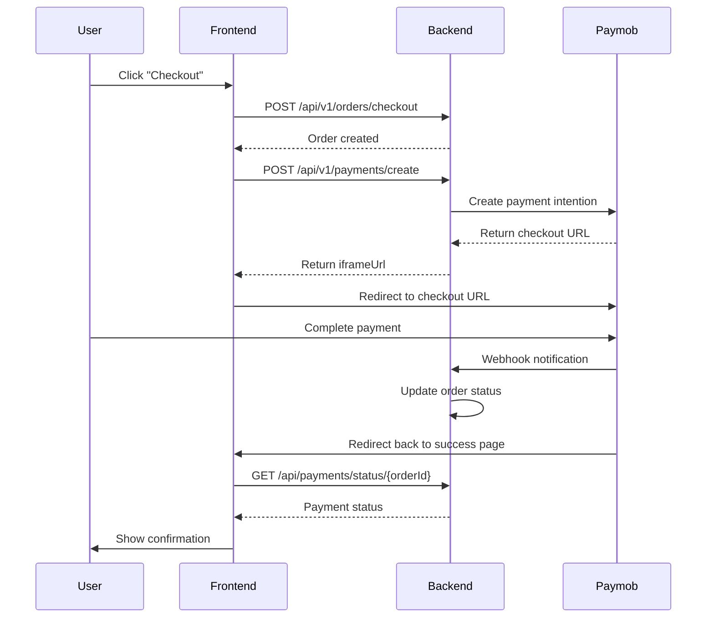

# 🛒 NestMart Payment Integration Guide for Frontend

## 📋 Table of Contents

1. [Overview](#overview)
2. [Payment Flow](#payment-flow)
3. [API Endpoints](#api-endpoints)
4. [Step-by-Step Integration](#step-by-step-integration)
5. [Code Examples](#code-examples)
6. [Error Handling](#error-handling)
7. [Testing](#testing)
8. [Security Considerations](#security-considerations)

---

## Overview

NestMart uses **Paymob** as the payment gateway. The payment flow involves:
1. Creating a payment session on the backend
2. Redirecting the user to Paymob's checkout page
3. Receiving payment confirmation via webhook
4. Polling for payment status after redirect

**Base URL:** `https://nestmart.runasp.net`

---

## Payment Flow



---

## API Endpoints

### 1. Create Order (Checkout)

**Endpoint:** `POST /api/v1/orders/checkout`

**Purpose:** Creates an order from the user's cart

**Authentication:** Required (JWT token OR X-Guest-Id header)

**Request Headers:**
```http
Authorization: Bearer {jwt_token}
OR
X-Guest-Id: {guest_id}
Content-Type: application/json
```

**Request Body:**
```json
{
  "firstName": "John",
  "lastName": "Doe",
  "email": "john.doe@example.com",
  "phone": "+201234567890",
  "address": "123 Main St",
  "city": "Cairo",
  "zipCode": "12345",
  "notes": "Please deliver before 5 PM"
}
```

**Response (Success - 200 OK):**
```json
{
  "success": true,
  "message": "Order created successfully",
  "data": {
    "orderId": 123,
    "totalAmount": 1500.00,
    "status": "Pending",
    "orderDate": "2026-02-26T12:00:00Z"
  }
}
```

**Response (Error - 400 Bad Request):**
```json
{
  "success": false,
  "message": "Cart is empty",
  "errors": []
}
```

---

### 2. Create Payment

**Endpoint:** `POST /api/v1/payments/create`

**Purpose:** Creates a payment session and returns Paymob checkout URL

**Authentication:** Required (JWT token OR X-Guest-Id header)

**Request Headers:**
```http
Authorization: Bearer {jwt_token}
OR
X-Guest-Id: {guest_id}
Content-Type: application/json
```

**Request Body:**
```json
{}
```
*Note: The backend automatically calculates the amount from the user's cart*

**Response (Success - 200 OK):**
```json
{
  "success": true,
  "iframeUrl": "https://accept.paymob.com/unifiedcheckout/?publicKey=egy_pk_xxx&clientSecret=xxx",
  "orderId": 123
}
```

**Response (Error - 400 Bad Request):**
```json
{
  "success": false,
  "message": "Cart is empty."
}
```

**Response (Error - 502 Bad Gateway):**
```json
{
  "success": false,
  "message": "Payment provider error.",
  "detail": "Connection timeout"
}
```

---

### 3. Get Payment Status

**Endpoint:** `GET /api/payments/status/{orderId}`

**Purpose:** Check the current payment and order status

**Authentication:** Not required (public endpoint)

**Request:**
```http
GET /api/payments/status/123
```

**Response (Success - 200 OK):**
```json
{
  "orderId": 123,
  "orderStatus": "Processing",
  "paymentStatus": "Paid",
  "transactionId": "999"
}
```

**Response (Error - 404 Not Found):**
```json
{
  "orderId": 123,
  "message": "Order not found"
}
```

**Possible Status Values:**

**Order Status:**
- `Pending` - Order created, awaiting payment
- `Processing` - Payment confirmed, order being processed
- `Shipped` - Order has been shipped
- `Delivered` - Order delivered to customer
- `Cancelled` - Order cancelled

**Payment Status:**
- `Pending` - Payment initiated, awaiting confirmation
- `Paid` - Payment successful
- `Failed` - Payment failed
- `Refunded` - Payment refunded
- `NotFound` - No payment record found

---

### 4. Get User Orders

**Endpoint:** `GET /api/v1/orders`

**Purpose:** Get all orders for the authenticated user

**Authentication:** Required

**Request Headers:**
```http
Authorization: Bearer {jwt_token}
OR
X-Guest-Id: {guest_id}
```

**Response (Success - 200 OK):**
```json
{
  "success": true,
  "data": [
    {
      "id": 123,
      "orderDate": "2026-02-26T12:00:00Z",
      "status": "Processing",
      "totalAmount": 1500.00,
      "items": [
        {
          "productName": "Product A",
          "quantity": 2,
          "unitPrice": 500.00
        }
      ]
    }
  ]
}
```

---

### 5. Get Order Details

**Endpoint:** `GET /api/v1/orders/{id}`

**Purpose:** Get details of a specific order

**Authentication:** Required

**Request:**
```http
GET /api/v1/orders/123
Authorization: Bearer {jwt_token}
```

**Response (Success - 200 OK):**
```json
{
  "success": true,
  "data": {
    "id": 123,
    "orderDate": "2026-02-26T12:00:00Z",
    "status": "Processing",
    "totalAmount": 1500.00,
    "firstName": "John",
    "lastName": "Doe",
    "email": "john.doe@example.com",
    "phone": "+201234567890",
    "address": "123 Main St",
    "city": "Cairo",
    "items": [
      {
        "productId": 1,
        "productName": "Product A",
        "quantity": 2,
        "unitPrice": 500.00,
        "totalPrice": 1000.00
      }
    ]
  }
}
```

---

## Step-by-Step Integration

### Step 1: Checkout Flow

When the user clicks "Proceed to Checkout":

```javascript
// 1. Collect shipping information
const checkoutData = {
  firstName: "John",
  lastName: "Doe",
  email: "john.doe@example.com",
  phone: "+201234567890",
  address: "123 Main St",
  city: "Cairo",
  zipCode: "12345",
  notes: "Optional delivery notes"
};

// 2. Create order
const orderResponse = await fetch('https://nestmart.runasp.net/api/v1/orders/checkout', {
  method: 'POST',
  headers: {
    'Content-Type': 'application/json',
    'Authorization': `Bearer ${userToken}`, // OR use X-Guest-Id header
  },
  body: JSON.stringify(checkoutData)
});

const orderResult = await orderResponse.json();

if (!orderResult.success) {
  // Handle error
  alert(orderResult.message);
  return;
}

const orderId = orderResult.data.orderId;
```

### Step 2: Create Payment

After order is created successfully:

```javascript
// 3. Create payment session
const paymentResponse = await fetch('https://nestmart.runasp.net/api/v1/payments/create', {
  method: 'POST',
  headers: {
    'Content-Type': 'application/json',
    'Authorization': `Bearer ${userToken}`, // OR use X-Guest-Id header
  },
  body: JSON.stringify({})
});

const paymentResult = await paymentResponse.json();

if (!paymentResult.success) {
  // Handle error
  alert(paymentResult.message);
  return;
}

// 4. Store orderId for later use
localStorage.setItem('pendingOrderId', paymentResult.orderId);

// 5. Redirect to Paymob checkout
window.location.href = paymentResult.iframeUrl;
```

### Step 3: Handle Return from Paymob

Create a payment success/callback page (e.g., `/payment-callback`):

```javascript
// On payment callback page
const orderId = localStorage.getItem('pendingOrderId');

if (!orderId) {
  // Redirect to home or orders page
  window.location.href = '/';
  return;
}

// Poll for payment status
async function checkPaymentStatus() {
  try {
    const response = await fetch(`https://nestmart.runasp.net/api/payments/status/${orderId}`);
    const result = await response.json();
    
    if (result.paymentStatus === 'Paid') {
      // Payment successful!
      localStorage.removeItem('pendingOrderId');
      
      // Clear cart
      await clearCart();
      
      // Show success message
      showSuccessMessage(orderId);
      
      // Redirect to order confirmation
      setTimeout(() => {
        window.location.href = `/orders/${orderId}`;
      }, 3000);
      
    } else if (result.paymentStatus === 'Failed') {
      // Payment failed
      showErrorMessage('Payment failed. Please try again.');
      
    } else if (result.paymentStatus === 'Pending') {
      // Still processing, poll again
      setTimeout(checkPaymentStatus, 2000); // Check again in 2 seconds
    }
    
  } catch (error) {
    console.error('Error checking payment status:', error);
    showErrorMessage('Error verifying payment. Please contact support.');
  }
}

// Start polling
checkPaymentStatus();
```

### Step 4: Display Order Confirmation

```javascript
// On order confirmation page
async function loadOrderDetails(orderId) {
  try {
    const response = await fetch(`https://nestmart.runasp.net/api/v1/orders/${orderId}`, {
      headers: {
        'Authorization': `Bearer ${userToken}`
      }
    });
    
    const result = await response.json();
    
    if (result.success) {
      displayOrderDetails(result.data);
    }
    
  } catch (error) {
    console.error('Error loading order:', error);
  }
}
```

---

## Code Examples

### React/Next.js Example

```typescript
// hooks/usePayment.ts
import { useState } from 'react';

interface CheckoutData {
  firstName: string;
  lastName: string;
  email: string;
  phone: string;
  address: string;
  city: string;
  zipCode: string;
  notes?: string;
}

export function usePayment() {
  const [loading, setLoading] = useState(false);
  const [error, setError] = useState<string | null>(null);

  const createOrder = async (data: CheckoutData) => {
    setLoading(true);
    setError(null);

    try {
      const token = localStorage.getItem('authToken');
      const guestId = localStorage.getItem('guestId');

      const headers: HeadersInit = {
        'Content-Type': 'application/json',
      };

      if (token) {
        headers['Authorization'] = `Bearer ${token}`;
      } else if (guestId) {
        headers['X-Guest-Id'] = guestId;
      }

      const response = await fetch('https://nestmart.runasp.net/api/v1/orders/checkout', {
        method: 'POST',
        headers,
        body: JSON.stringify(data),
      });

      const result = await response.json();

      if (!result.success) {
        throw new Error(result.message);
      }

      return result.data;
    } catch (err) {
      const message = err instanceof Error ? err.message : 'Failed to create order';
      setError(message);
      throw err;
    } finally {
      setLoading(false);
    }
  };

  const createPayment = async () => {
    setLoading(true);
    setError(null);

    try {
      const token = localStorage.getItem('authToken');
      const guestId = localStorage.getItem('guestId');

      const headers: HeadersInit = {
        'Content-Type': 'application/json',
      };

      if (token) {
        headers['Authorization'] = `Bearer ${token}`;
      } else if (guestId) {
        headers['X-Guest-Id'] = guestId;
      }

      const response = await fetch('https://nestmart.runasp.net/api/v1/payments/create', {
        method: 'POST',
        headers,
        body: JSON.stringify({}),
      });

      const result = await response.json();

      if (!result.success) {
        throw new Error(result.message);
      }

      return result;
    } catch (err) {
      const message = err instanceof Error ? err.message : 'Failed to create payment';
      setError(message);
      throw err;
    } finally {
      setLoading(false);
    }
  };

  const checkPaymentStatus = async (orderId: number) => {
    try {
      const response = await fetch(`https://nestmart.runasp.net/api/payments/status/${orderId}`);
      const result = await response.json();
      return result;
    } catch (err) {
      const message = err instanceof Error ? err.message : 'Failed to check payment status';
      setError(message);
      throw err;
    }
  };

  return {
    createOrder,
    createPayment,
    checkPaymentStatus,
    loading,
    error,
  };
}
```

```typescript
// components/CheckoutForm.tsx
import { useState } from 'react';
import { usePayment } from '../hooks/usePayment';

export function CheckoutForm() {
  const { createOrder, createPayment, loading, error } = usePayment();
  const [formData, setFormData] = useState({
    firstName: '',
    lastName: '',
    email: '',
    phone: '',
    address: '',
    city: '',
    zipCode: '',
    notes: '',
  });

  const handleSubmit = async (e: React.FormEvent) => {
    e.preventDefault();

    try {
      // Step 1: Create order
      const order = await createOrder(formData);
      console.log('Order created:', order.orderId);

      // Step 2: Create payment
      const payment = await createPayment();
      console.log('Payment created:', payment.orderId);

      // Step 3: Store order ID and redirect to Paymob
      localStorage.setItem('pendingOrderId', payment.orderId.toString());
      window.location.href = payment.iframeUrl;

    } catch (err) {
      console.error('Checkout error:', err);
    }
  };

  return (
    <form onSubmit={handleSubmit}>
      {error && <div className="error">{error}</div>}
      
      <input
        type="text"
        placeholder="First Name"
        value={formData.firstName}
        onChange={(e) => setFormData({ ...formData, firstName: e.target.value })}
        required
      />
      
      <input
        type="text"
        placeholder="Last Name"
        value={formData.lastName}
        onChange={(e) => setFormData({ ...formData, lastName: e.target.value })}
        required
      />
      
      <input
        type="email"
        placeholder="Email"
        value={formData.email}
        onChange={(e) => setFormData({ ...formData, email: e.target.value })}
        required
      />
      
      <input
        type="tel"
        placeholder="Phone"
        value={formData.phone}
        onChange={(e) => setFormData({ ...formData, phone: e.target.value })}
        required
      />
      
      <input
        type="text"
        placeholder="Address"
        value={formData.address}
        onChange={(e) => setFormData({ ...formData, address: e.target.value })}
        required
      />
      
      <input
        type="text"
        placeholder="City"
        value={formData.city}
        onChange={(e) => setFormData({ ...formData, city: e.target.value })}
        required
      />
      
      <input
        type="text"
        placeholder="Zip Code"
        value={formData.zipCode}
        onChange={(e) => setFormData({ ...formData, zipCode: e.target.value })}
        required
      />
      
      <textarea
        placeholder="Delivery Notes (Optional)"
        value={formData.notes}
        onChange={(e) => setFormData({ ...formData, notes: e.target.value })}
      />
      
      <button type="submit" disabled={loading}>
        {loading ? 'Processing...' : 'Proceed to Payment'}
      </button>
    </form>
  );
}
```

```typescript
// pages/payment-callback.tsx
import { useEffect, useState } from 'react';
import { useRouter } from 'next/router';
import { usePayment } from '../hooks/usePayment';

export default function PaymentCallback() {
  const router = useRouter();
  const { checkPaymentStatus } = usePayment();
  const [status, setStatus] = useState<'checking' | 'success' | 'failed' | 'pending'>('checking');
  const [orderId, setOrderId] = useState<number | null>(null);

  useEffect(() => {
    const pendingOrderId = localStorage.getItem('pendingOrderId');
    
    if (!pendingOrderId) {
      router.push('/');
      return;
    }

    setOrderId(parseInt(pendingOrderId));
    pollPaymentStatus(parseInt(pendingOrderId));
  }, []);

  const pollPaymentStatus = async (orderId: number, attempts = 0) => {
    if (attempts > 30) {
      // Max 30 attempts (60 seconds)
      setStatus('failed');
      return;
    }

    try {
      const result = await checkPaymentStatus(orderId);

      if (result.paymentStatus === 'Paid') {
        setStatus('success');
        localStorage.removeItem('pendingOrderId');
        
        // Clear cart
        // await clearCart();
        
        // Redirect to order page after 3 seconds
        setTimeout(() => {
          router.push(`/orders/${orderId}`);
        }, 3000);
        
      } else if (result.paymentStatus === 'Failed') {
        setStatus('failed');
        localStorage.removeItem('pendingOrderId');
        
      } else {
        // Still pending, check again
        setStatus('pending');
        setTimeout(() => pollPaymentStatus(orderId, attempts + 1), 2000);
      }
      
    } catch (error) {
      console.error('Error checking payment status:', error);
      setTimeout(() => pollPaymentStatus(orderId, attempts + 1), 2000);
    }
  };

  return (
    <div className="payment-callback">
      {status === 'checking' && (
        <div>
          <h2>Verifying Payment...</h2>
          <p>Please wait while we confirm your payment.</p>
        </div>
      )}
      
      {status === 'pending' && (
        <div>
          <h2>Processing Payment...</h2>
          <p>Your payment is being processed. Please wait.</p>
        </div>
      )}
      
      {status === 'success' && (
        <div>
          <h2>✅ Payment Successful!</h2>
          <p>Your order #{orderId} has been confirmed.</p>
          <p>Redirecting to order details...</p>
        </div>
      )}
      
      {status === 'failed' && (
        <div>
          <h2>❌ Payment Failed</h2>
          <p>Your payment could not be processed.</p>
          <button onClick={() => router.push('/cart')}>
            Return to Cart
          </button>
        </div>
      )}
    </div>
  );
}
```

---

### Vue.js Example

```typescript
// composables/usePayment.ts
import { ref } from 'vue';

export function usePayment() {
  const loading = ref(false);
  const error = ref<string | null>(null);

  const createOrder = async (data: any) => {
    loading.value = true;
    error.value = null;

    try {
      const token = localStorage.getItem('authToken');
      const guestId = localStorage.getItem('guestId');

      const headers: HeadersInit = {
        'Content-Type': 'application/json',
      };

      if (token) {
        headers['Authorization'] = `Bearer ${token}`;
      } else if (guestId) {
        headers['X-Guest-Id'] = guestId;
      }

      const response = await fetch('https://nestmart.runasp.net/api/v1/orders/checkout', {
        method: 'POST',
        headers,
        body: JSON.stringify(data),
      });

      const result = await response.json();

      if (!result.success) {
        throw new Error(result.message);
      }

      return result.data;
    } catch (err) {
      error.value = err instanceof Error ? err.message : 'Failed to create order';
      throw err;
    } finally {
      loading.value = false;
    }
  };

  const createPayment = async () => {
    loading.value = true;
    error.value = null;

    try {
      const token = localStorage.getItem('authToken');
      const guestId = localStorage.getItem('guestId');

      const headers: HeadersInit = {
        'Content-Type': 'application/json',
      };

      if (token) {
        headers['Authorization'] = `Bearer ${token}`;
      } else if (guestId) {
        headers['X-Guest-Id'] = guestId;
      }

      const response = await fetch('https://nestmart.runasp.net/api/v1/payments/create', {
        method: 'POST',
        headers,
        body: JSON.stringify({}),
      });

      const result = await response.json();

      if (!result.success) {
        throw new Error(result.message);
      }

      return result;
    } catch (err) {
      error.value = err instanceof Error ? err.message : 'Failed to create payment';
      throw err;
    } finally {
      loading.value = false;
    }
  };

  const checkPaymentStatus = async (orderId: number) => {
    try {
      const response = await fetch(`https://nestmart.runasp.net/api/payments/status/${orderId}`);
      return await response.json();
    } catch (err) {
      error.value = err instanceof Error ? err.message : 'Failed to check payment status';
      throw err;
    }
  };

  return {
    createOrder,
    createPayment,
    checkPaymentStatus,
    loading,
    error,
  };
}
```

---

## Error Handling

### Common Errors and Solutions

| Error | Cause | Solution |
|-------|-------|----------|
| 401 Unauthorized | Missing or invalid token | Ensure JWT token or X-Guest-Id header is sent |
| 400 Bad Request - "Cart is empty" | User's cart has no items | Redirect to cart page |
| 502 Bad Gateway | Paymob service unavailable | Show error message, allow retry |
| 404 Not Found | Order doesn't exist | Verify order ID is correct |
| Network Error | Connection timeout | Implement retry logic |

### Error Handling Best Practices

```typescript
async function handlePayment() {
  try {
    const payment = await createPayment();
    window.location.href = payment.iframeUrl;
    
  } catch (error) {
    if (error.message.includes('Cart is empty')) {
      alert('Your cart is empty. Please add items before checkout.');
      router.push('/products');
      
    } else if (error.message.includes('Payment provider error')) {
      alert('Payment service is temporarily unavailable. Please try again later.');
      
    } else if (error.message.includes('Unauthorized')) {
      alert('Please login to continue.');
      router.push('/login');
      
    } else {
      alert('An error occurred. Please try again.');
      console.error('Payment error:', error);
    }
  }
}
```

---

## Testing

### Test Payment Flow

1. **Test Endpoint Available:**
   ```bash
   curl -X POST https://nestmart.runasp.net/api/payments/webhook/paymob/test \
     -H "Content-Type: application/json" \
     -d '{
       "id": "intent_test_001",
       "pending": false,
       "amount": 100000,
       "currency": "EGP",
       "success": true,
       "failure": false,
       "is_live": false,
       "special_reference": "1",
       "transactions": [{"id": 999, "status": "success"}]
     }'
   ```

2. **Test with Paymob Test Cards:**
   - **Success:** `4987654321098769`
   - **Declined:** `4000000000000002`
   - **Insufficient Funds:** `4000000000009995`

3. **Test Order Creation:**
   ```javascript
   // Create a test order
   const testOrder = {
     firstName: "Test",
     lastName: "User",
     email: "test@example.com",
     phone: "+201234567890",
     address: "Test Address",
     city: "Cairo",
     zipCode: "12345"
   };
   ```

---

## Security Considerations

### 1. Never Store Sensitive Data

❌ **DON'T:**
```javascript
// Never store card details
localStorage.setItem('cardNumber', '4111111111111111');
```

✅ **DO:**
```javascript
// Only store order ID
localStorage.setItem('pendingOrderId', orderId);
```

### 2. Always Use HTTPS

All API calls must use HTTPS. The backend enforces this for webhooks.

### 3. Validate on Backend

Never trust client-side calculations. The backend recalculates all amounts from the cart.

### 4. Handle Tokens Securely

```javascript
// Store JWT token securely
const token = response.data.token;
localStorage.setItem('authToken', token);

// Always send in Authorization header
headers['Authorization'] = `Bearer ${token}`;
```

### 5. Implement CSRF Protection

If using cookies for authentication, implement CSRF tokens.

---

## Webhook Handling (Backend Only)

**Note:** Webhooks are handled automatically by the backend. Frontend doesn't need to implement webhook handling.

The backend receives webhook notifications at:
```
POST https://nestmart.runasp.net/api/payments/webhook/paymob
```

This endpoint:
- Verifies HMAC signature
- Updates order status
- Updates payment status
- Stores transaction details

---

## FAQ

### Q: How long should I poll for payment status?

**A:** Poll every 2 seconds for up to 60 seconds (30 attempts). If status is still pending after that, show a message asking the user to check their order history.

### Q: What if the user closes the browser during payment?

**A:** The order ID is stored in localStorage. When they return, check for `pendingOrderId` and resume status polling.

### Q: Can I use the same endpoint for guest and authenticated users?

**A:** Yes! Use either:
- `Authorization: Bearer {token}` for authenticated users
- `X-Guest-Id: {guestId}` for guest users

### Q: How do I handle payment failures?

**A:** The payment status endpoint will return `paymentStatus: "Failed"`. Show an error message and allow the user to retry or return to cart.

### Q: Should I clear the cart immediately after creating payment?

**A:** No! Only clear the cart after confirming payment success (when `paymentStatus === "Paid"`).

### Q: What's the difference between orderStatus and paymentStatus?

**A:**
- `orderStatus`: Order lifecycle (Pending → Processing → Shipped → Delivered)
- `paymentStatus`: Payment state (Pending → Paid/Failed)

### Q: Can I test payments without real money?

**A:** Yes! The backend is currently configured with Paymob TEST keys. Use test card numbers provided by Paymob.

---

## Support

### Backend API Issues
- Check `TROUBLESHOOTING.md`
- Review application logs
- Contact backend team

### Paymob Integration Issues
- [Paymob Documentation](https://docs.paymob.com)
- [Paymob Support](https://accept.paymob.com/support)

### Frontend Integration Help
- Review code examples above
- Check browser console for errors
- Verify API endpoints are correct

---

## Changelog

| Date | Version | Changes |
|------|---------|---------|
| 2026-02-26 | 1.0 | Initial payment integration guide |

---

**API Base URL:** `https://nestmart.runasp.net`  
**Paymob Mode:** TEST (use test cards)  
**Status:** ✅ Production Ready
